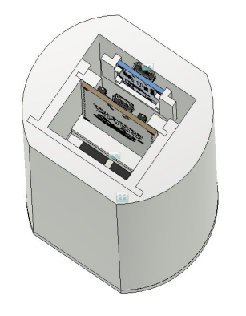
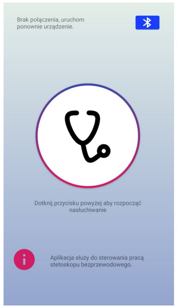
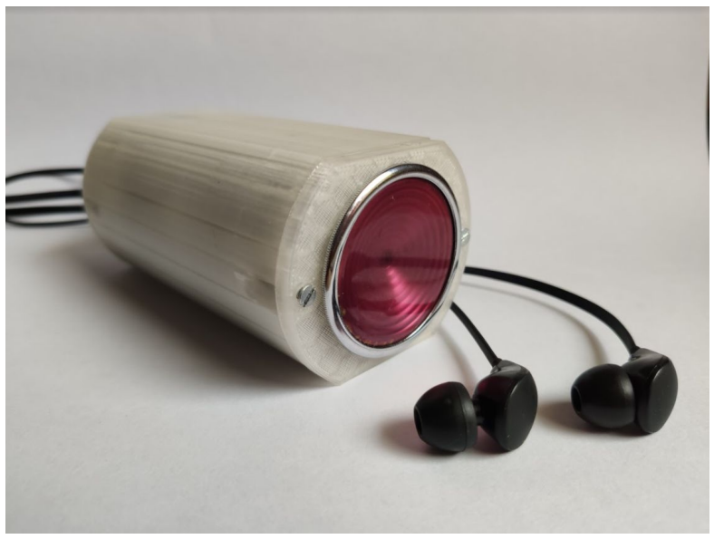
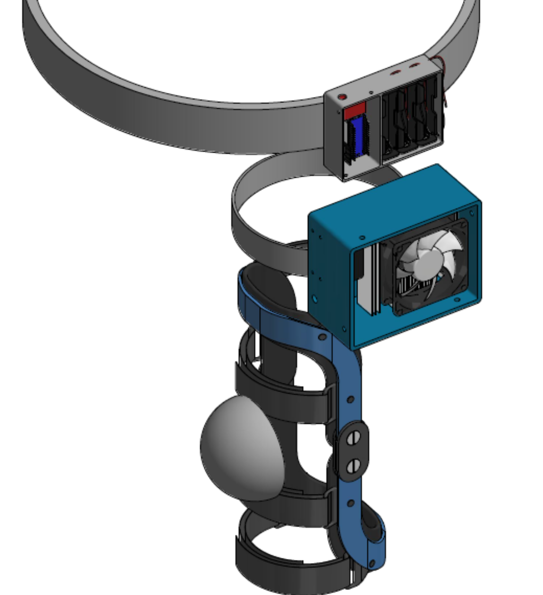
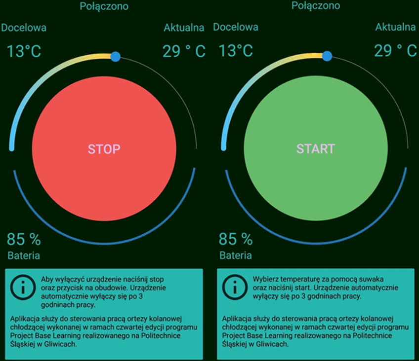
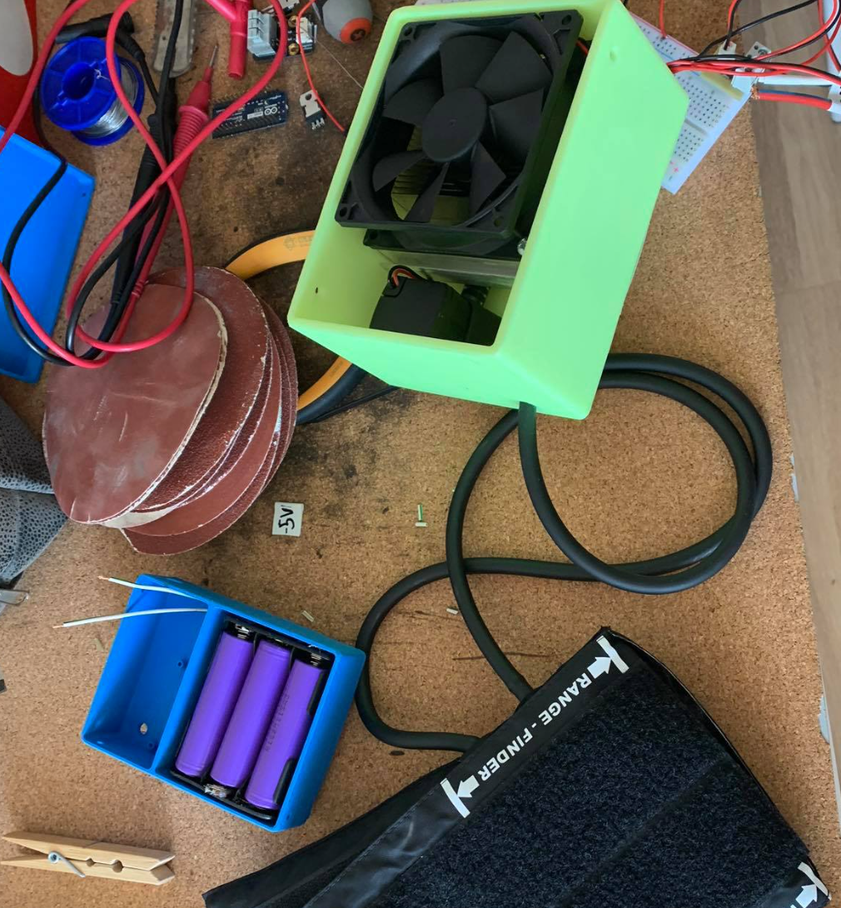
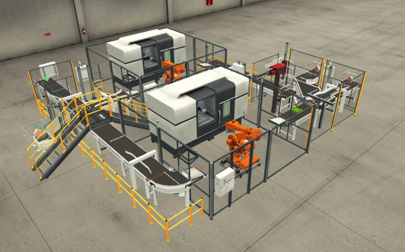
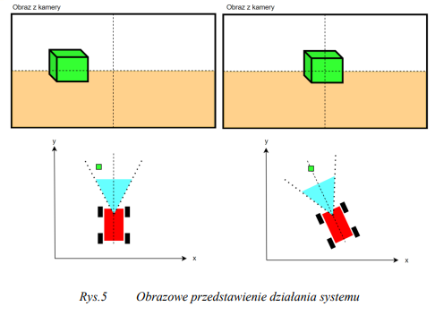
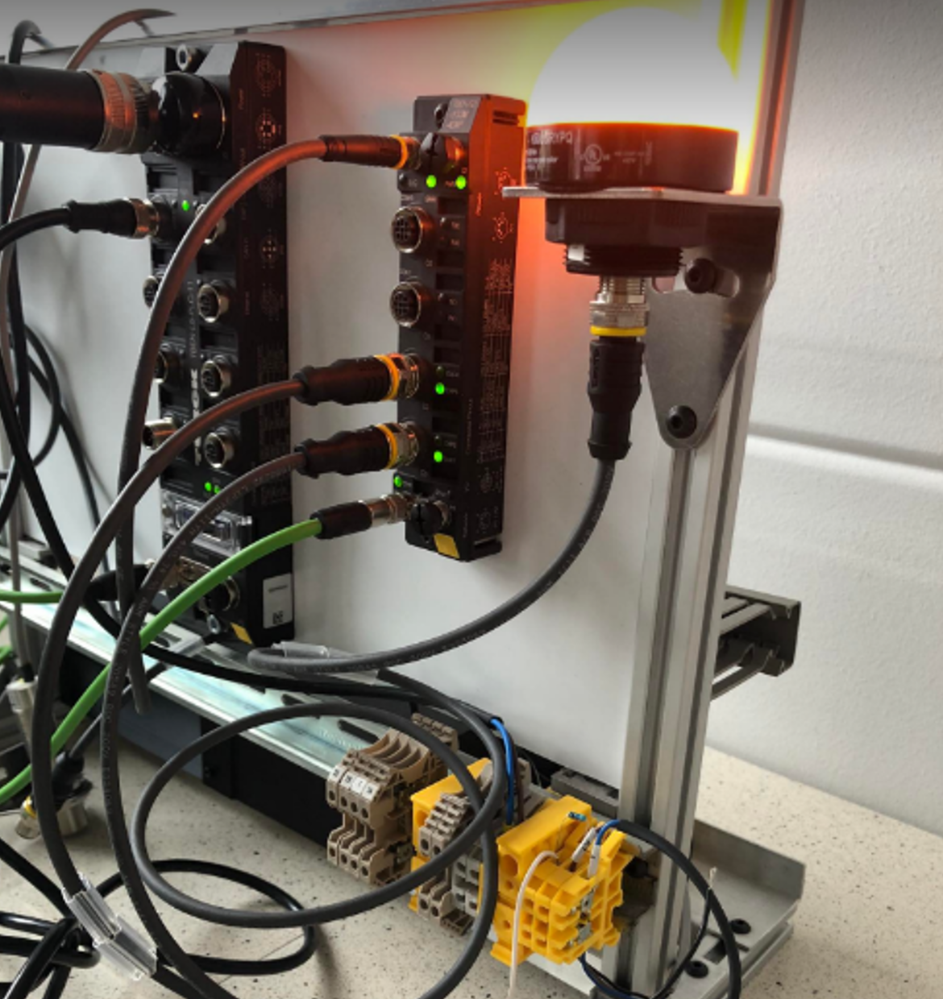

# Portfolio

# [PORTFOLIO IN ENGLISH](https://github.com/ptrkmiel/Summary/blob/main/sites/en.md)

Baza wybranych projektów które wykonałem.

## Sterowanie zaworami magazynów ciepła dla przydomowego systemu ogrzewania (Embedded System)

Zaprojektowano dedykowany, prosty system sterowania dla złożonego układu grzewczego w domu jednorodzinnym, z uwagi na niemożliwość użycia standardowych sterowników. System zapewnia utrzymanie równych temperatur w dwóch magazynach ciepła poprzez sterowanie przepływem ciepła za pomocą zaworów. System posiada wbudowane funkcje bezpieczeństwa, a wskazania czujników są wyświetlane na LCD dla wygody monitorowania. Przeprowadzono testy na symulatorze a następnie na działającym systemie ogrzewania, co pozwoliło na dostosowanie i weryfikację rozwiązania.

Więcej informacji dostępnych [tutaj.]()

## DIY Multi-purpose CNC Machine

Zdecydowano się na stworzenie małej frezarki typu CNC, przy czym kluczowym założeniem było zapewnienie wymienialności głowicy, aby narzędzie mogło służyć wielu różnym funkcjom. To połączenie frezarki CNC z drukarką 3D pozwoli na łatwą adaptację maszyny do różnych zastosowań, wystarczy jedynie wymienić głowicę.

Więcej informacji dostępnych [tutaj.]()

## PROJEKT INŻYNIERSKI 

Temat: Modelowanie matematyczne oraz symulacja działania systemu pompy ciepła w zastosowaniu ogrzewania budynków

Celem niniejszego projektu jest opracowanie modeli matematycznych oraz wykonanie symulacji działania systemu pompy ciepła w zastosowaniu ogrzewania budynków jednorodzinnych. W ramach projektu przeprowadzono analizę literatury o tematyce wykorzystania i budowy sprężarkowych pomp grzejnych w celu ogrzewania budynków oraz dokonano przeglądu obecnych na runku rozwiązań. W ramach projektu przyjęto założenia obliczeniowe i dobrano parametry systemu pompy ciepła dla zadanego przypadku. Rezultatem projektu jest opracowany model pompy ciepła oraz model termodynamiki budynku ogrzewanego, wykonane w środowisku MATLAB Simulink. Po wykonaniu symulacji działania systemu dokonano analizy wyników. Uzyskane wyniki symulacji wskazują poprawność działania systemu.

Więcej informacji dostępnych [tutaj.](https://github.com/ptrkmiel/Summary/blob/main/sites/inzynierka.png)

## PRACA MAGISTERSKA

Celem pracy magisterskiej jest opracowanie systemu wykrywania sytuacji krytycznych dla pojazdów autonomicznych.

Więcej szczegółów wkrótce.

## Project Based Learning - Stetoskop bezprzewodowy

Celem projektu było stworzenie bezprzewodowego stetoskopu umożliwiającego odsłuch na smarfonie. Moim zadaniem było stworzenie aplikacji na system Android umożliwiającej zdalny odsłuch poprzez połączenie Bluetooth.

## Project Based Learning - Orteza kriogeniczna

Celem projektu było zbudowanie ortezy umożliwiającej chłodzenie stawu kolanowego. Czynnikiem chłodzącym była ciecz schładzana za pomocą ogniwa peltiera zasilanego poprzez zestaw akumulatorów. Takie rozwiązanie zapewniło mobilność urządzenia. Dodatkowym elementem była aplikacja na system Android umożliwiajaca ustawienie temperatury oraz monitorowanie parametrów.

## Projekty akademickie związane z automatyką

W tej sekcji przedstawiłem wybrane projekty związane z szeroko pojętą automatyką (PLC, robotyka, programowanie).

Więcej informacji dostępnych [tutaj.](https://github.com/ptrkmiel/Summary/blob/main/sites/auto.md)

## Projekty Akademickie CAD (Siemens NX, AutoDesk Inventor, Ansys)

W tej sekcji przedstawiłem wybrane projekty wykonane w CAD wykonane w ramach studiów.

Więcej informacji dostępnych [tutaj.](https://github.com/ptrkmiel/Summary/blob/main/sites/CAD.md)

##

