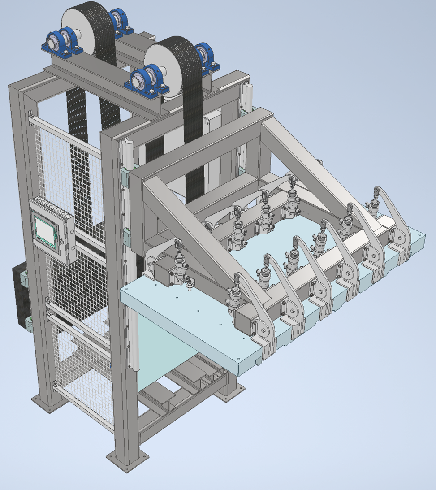
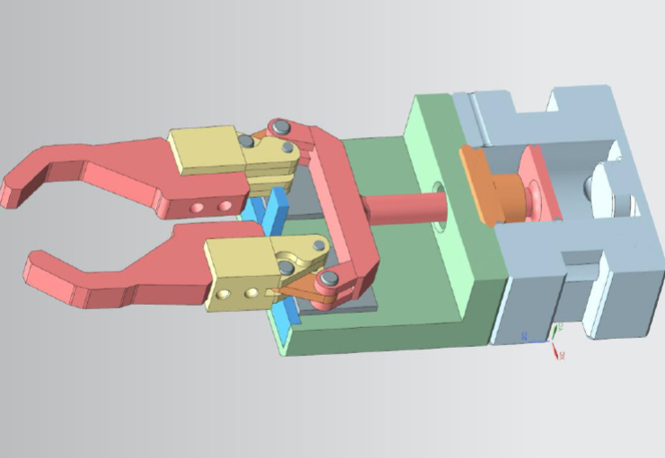
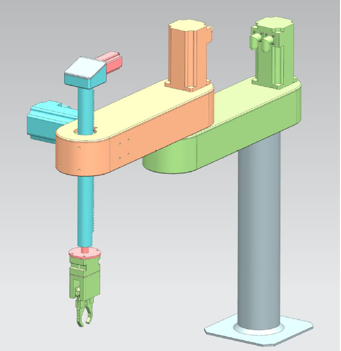

# Summary

ibcucucucucucucucucucucucucucucucu

## Projekty Akademickie CAD (Siemens NX, AutoDesk Inventor)

W tej sekcji przedstawiłem wybrane projekty wykonane w CAD wykonane w ramach studiów.
Więcej informacji dostępnych [tutaj.](https://github.com/ptrkmiel/Summary/blob/main/sites/CAD.md)

## Sterowanie zaworami magazynów ciepła dla przydomowego systemu ogrzewania (Embedded System)

Zaprojektowano dedykowany, prosty system sterowania dla złożonego układu grzewczego w domu jednorodzinnym, z uwagi na niemożliwość użycia standardowych sterowników. System zapewnia utrzymanie równych temperatur w dwóch magazynach ciepła poprzez sterowanie przepływem ciepła za pomocą zaworów. System posiada wbudowane funkcje bezpieczeństwa, a wskazania czujników są wyświetlane na LCD dla wygody monitorowania. Przeprowadzono testy na symulatorze a następnie na działającym systemie ogrzewania, co pozwoliło na dostosowanie i weryfikację rozwiązania.

Więcej informacji dostępnych [tutaj.]()

## DIY Multi-purpose CNC Machine

Zdecydowano się na stworzenie małej frezarki typu CNC, przy czym kluczowym założeniem było zapewnienie wymienialności głowicy, aby narzędzie mogło służyć wielu różnym funkcjom. To połączenie frezarki CNC z drukarką 3D pozwoli na łatwą adaptację maszyny do różnych zastosowań, wystarczy jedynie wymienić głowicę.

Więcej informacji dostępnych [tutaj.]()

## PROJEKT INŻYNIERSKI 

Temat: Modelowanie matematyczne oraz symulacja działania systemu pompy ciepła w zastosowaniu ogrzewania budynków

Celem niniejszego projektu jest opracowanie modeli matematycznych oraz wykonanie symulacji działania systemu pompy ciepła w zastosowaniu ogrzewania budynków jednorodzinnych. W ramach projektu przeprowadzono analizę literatury o tematyce wykorzystania i budowy sprężarkowych pomp grzejnych w celu ogrzewania budynków oraz dokonano przeglądu obecnych na runku rozwiązań. W ramach projektu przyjęto założenia obliczeniowe i dobrano parametry systemu pompy ciepła dla zadanego przypadku. Rezultatem projektu jest opracowany model pompy ciepła oraz model termodynamiki budynku ogrzewanego, wykonane w środowisku MATLAB Simulink. Po wykonaniu symulacji działania systemu dokonano analizy wyników. Uzyskane wyniki symulacji wskazują poprawność działania systemu.

Więcej informacji dostępnych [tutaj.](https://github.com/ptrkmiel/Summary/blob/main/sites/inzynierka.png)

## PRACA MAGISTERSKA

