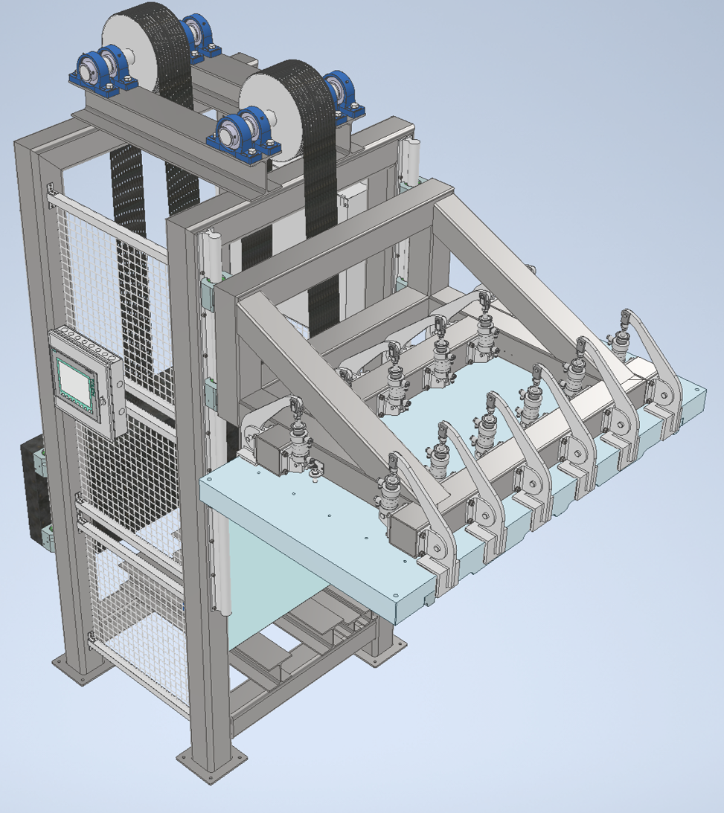
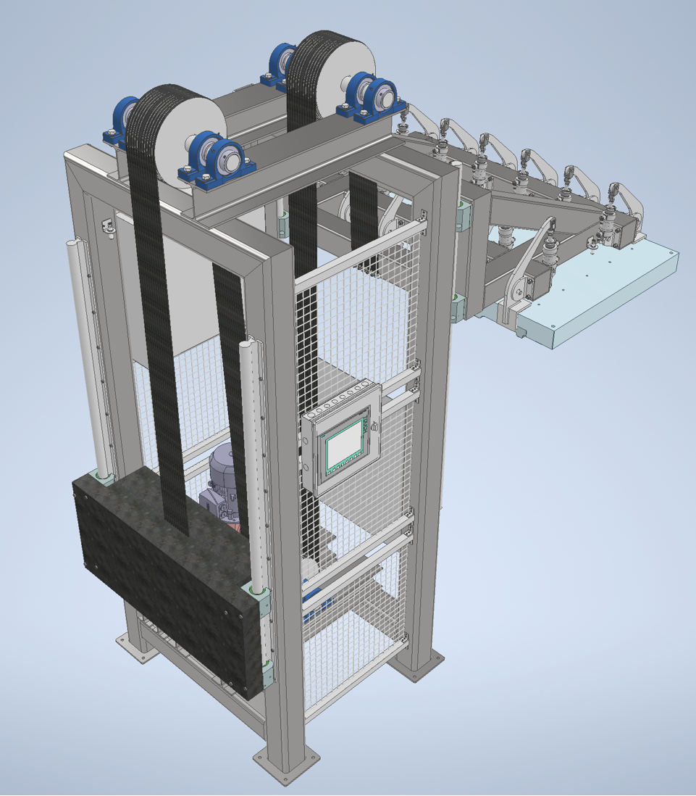
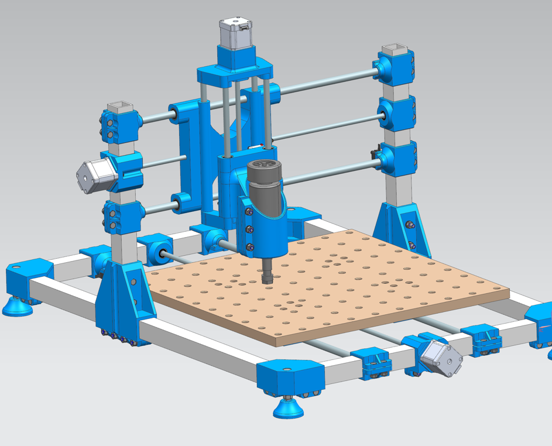
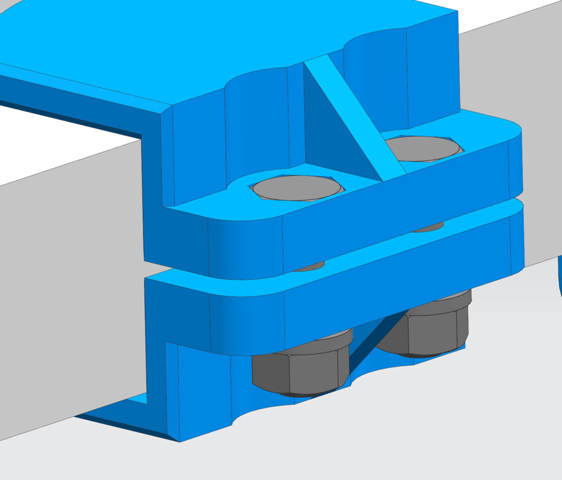
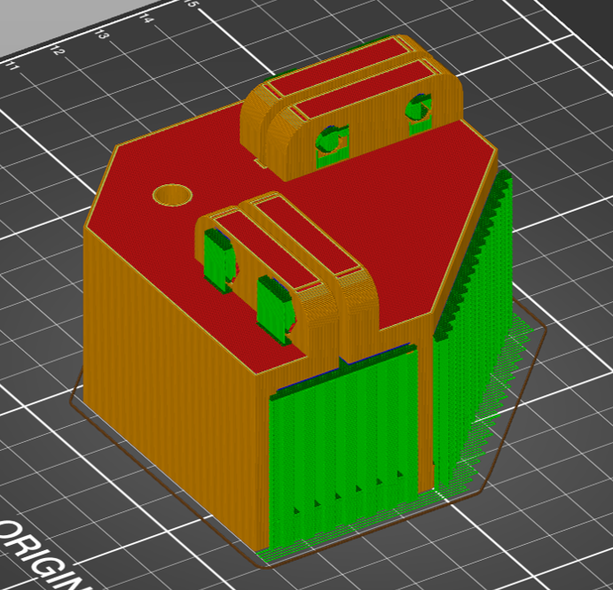
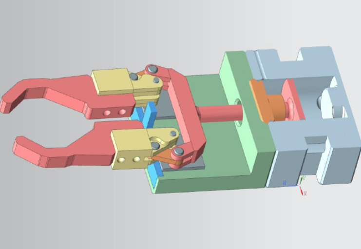
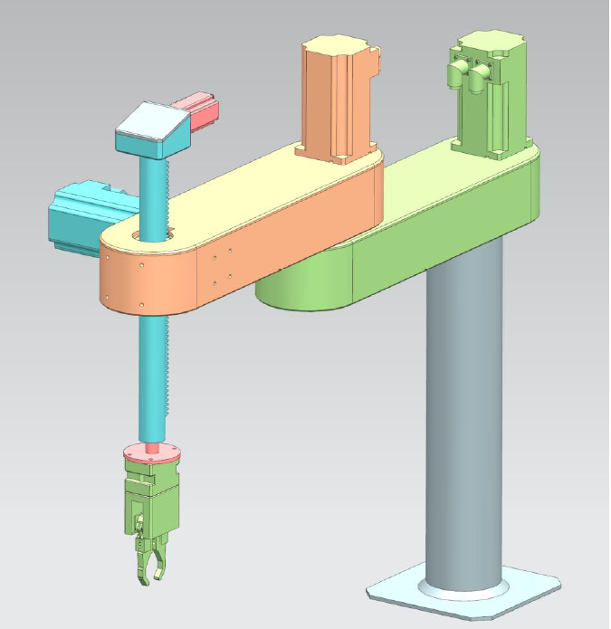
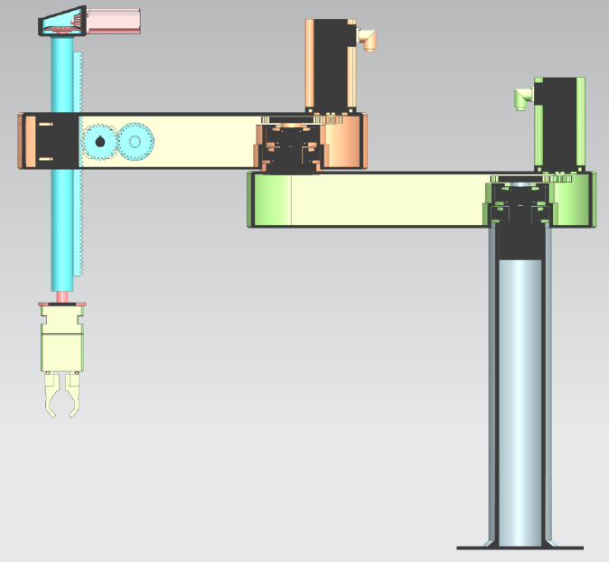
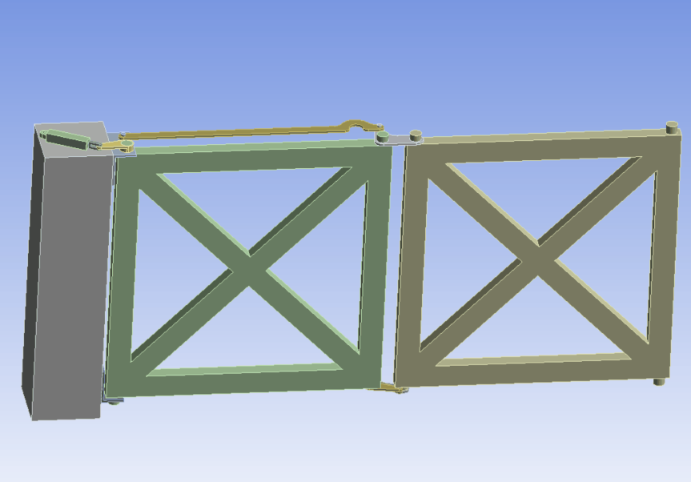
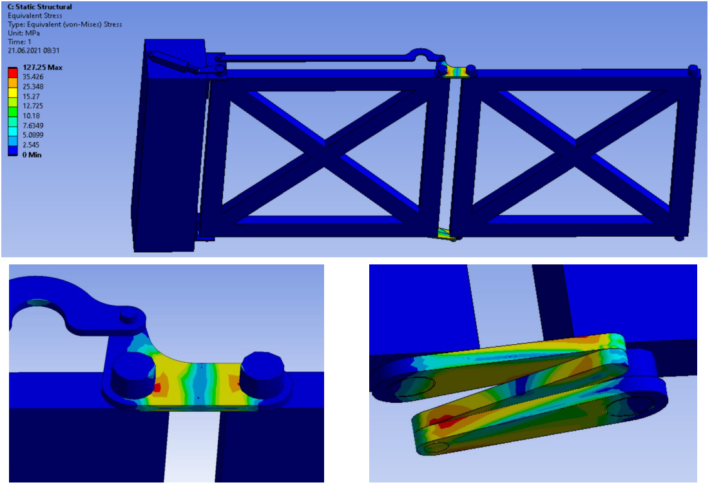

## Dzwig górnego narzędzia do hydroformowania (Autodesk Inventor)

W ramach projektu akademickiego utworzono model dźwigu przeznaczonego jest do podnoszenia górnego narzędzia prasy do hydroformowania. Wymiary oraz kształt były definiowane w założeniach ze względu na dostępną przestrzeń roboczą. W projekcie zwrócono uwagę na jednostkowy wymiar produkcji, z tego względu zastosowano jak największą ilość cześci standardowych. 

## Frezarka wydrukowana na drukarce 3D (Siemens NX)

W ramach projektu akademickiego swtorzono model frezarki 3-osiowej składającej się z elementów dostępnych w sprzedaży oraz elementów wydrukowanych na drukarce 3D. W celu ułatwienia montażu elementów wykonano specjalne gniazda na łeb śruby lub nakrętki oraz zastosowano tuleje gwintowe wtapiane w elementy drukowane. Następnie zbadano wytrzymałość elementów oraz przerowadzono symulację ruchu. 

Nagranie symulacji ruchu: https://youtu.be/9rTvDCCXPS4?t=56

## Chwytak manipulatora (Siemens NX)

Celem było zamodelowanie dwupalcowego chwytaka kątowego w środowisku Siemens NX12. 

## Prosty manipulator typu SCARA 4-osiowy (Siemens NX)

Wykonano model 4-osiowego manipulatora typu SCARA. W projekcie wykorzystano gotowe elementy liniowe i obrotowe. Modele gotowych elementów zaczęrpnięto z bazy danych CAD.

## Projekt symulacji mechaniki w środowisku ANSYS

W śrdowisku Ansys stworzono model dwuskrzydłowej bramy składanej którego założeniem było aby cały rych był wykonywany tlko przez jeden siłownik. Po zamodelowaniu układu przeprowadzono analizę dynamiczną oraz analizę wytrzymałościową elementów krytycznych.

Źródło pomysłu oraz nagranie: https://mechamechanisms.com/bi-folding-gate-2

