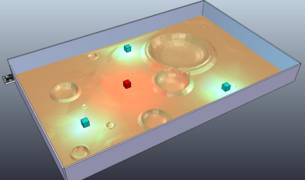
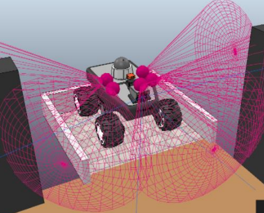
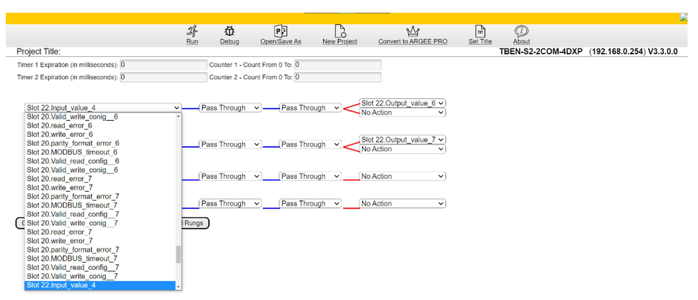

## Projekt fabryki w symulatorze Factory I/O sprzęgniętym z Tia Portal

Celem projektu jest opracowanie modelu układu automatyki prostej linii produkcyjnej. Model ma zostać wykonany w środowisku Factory I/O, a sterowanie układu automatyki w środowisku Siemens TIA Portal V16.

Nagranie z symulacji: https://youtu.be/txS5lsZuBak

## Lua

W celu realizacji projektu należy zaprojektować i opracować model robota eksploracyjnego, którego zadaniem jest odnalezieniem w jak najkrótszym czasie przedmiotu o określonym odgórnie ID. Planszę na której jeździ robot należy podzielić na sektory a robota umieścić na krańcu jednej z nich. Robot ma za zadanie poruszać się po symulowanej powierzchni marsa i odnajdywać przedmioty oznaczone markerami, musi przeskanować zadany teren omijając przeszkody i zapisywać numer sektora oraz zapamiętywać przejechaną trasę. Robot może posiadać różnego rodzaju czujniki z wyjątkiem modułu GPS. Użytkownik ma zostać powiadomiony o czasie dotarcia do szukanego elementu, a dane muszą zostać zapisane do pliku csv.

## Automatyka budynkowa

## OPC python client

Celem projektu było przygotowanie symulatora w języku Python, który umożliwiałby połączenie się z serwerem OPC oraz odczyt i nadawanie danych dla poszczególnych adresów sieci.

## Turck

Celem projektu było zapoznianie się z serią prostych sterowników programowalnych marki Turck. 

## ... oraz wiele więcej małych projektów PLC opartych na sterownikach Siemens, programownych zarówno w LOGO jak i Tia
