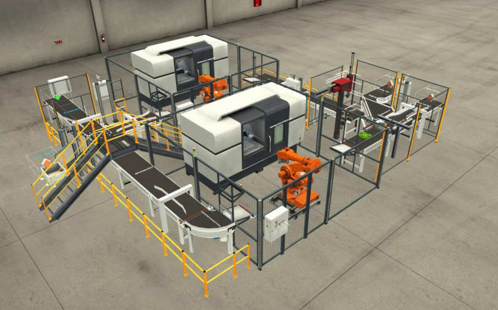

## Projekt fabryki w symulatorze Factory I/O sprzęgniętym z Tia Portal

Celem projektu jest opracowanie modelu układu automatyki prostej linii produkcyjnej. Model ma zostać wykonany w środowisku Factory I/O, a sterowanie układu automatyki w środowisku Siemens TIA Portal V16.

Fabryka umożliwia produkowanie dwóch rodzajów produktów. W programie pierwszym podstawa produktu jest metalowa a wieczko wykonane z tworzywa sztucznego. W programie drugim zarówno wieczko jak i podstawa jest metalowe. Układ podzielono na trzy etapy: część dostarczenia półproduktów, część produkcji oraz część montażu i wydania produktów. Elementami wejściowymi do układu są surowe płyty wykonane z tworzywa sztucznego lub metalu. Płyty te dostarczane są w sposób losowy na pierwszy taśmociąg. Na końcu taśmociągu znajduje się detektor który aktywuje czujnik indukcyjny który sprawdza czy dostarczonym materiałem jest płyta z tworzywa sztucznego czy metalu. Za pierwszym taśmociągiem znajduje się sortownik. W zależności od uruchomionego programu surowa płyta trafia na odpowiednie miejsce. Jeżeli uruchomiony jest program pierwszy płyta metalowa powinna przejść prosto, a płyta wykonana z tworzywa sztucznego skręcić w lewo. Jeżeli w celach zrobotyzowanych oraz w buforach przed nimi znajdują się już płyty, kolejna czeka na pierwszym taśmociągu. Jeżeli został wybrany program drugi, do dwóch celi zrobotyzowanych powinna trafić płyta metalowa. Jeżeli operator pierwszego taśmociągu dostarczy jednak płytę z tworzywa sztucznego powinna być ona przekierowana na prawo i trafić do zewnętrznej skrzyni. Do skrzyni trafiają również płyty w wypadku gdy linia stoi z powodu braku konkretnego rodzaju płyt. Operator pierwszego taśmociągu jest informowany o stanie załadowania buforów. Drugim etapem jest część produkcji. Składa się on z dwóch standardowych celi zrobotyzowanych z obrabiarkami. Jedna cela produkuje podstawy a druga wieczka. Jeżeli na podajniku czeka surowa płyta oraz w miejscu odkładania elementu nie znajduje się przedmiot robot rozpoczyna cykl pracy.

Nagranie z symulacji: https://youtu.be/txS5lsZuBak

## Lua

## Automatyka budynkowa

## Process simulate

## OPC python client

## SCADA -iFix

## Turck

